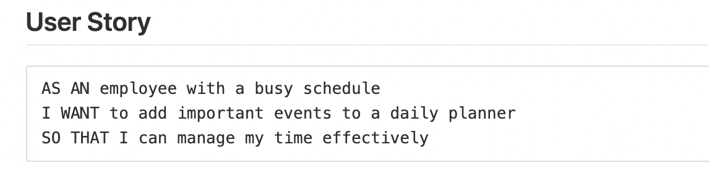
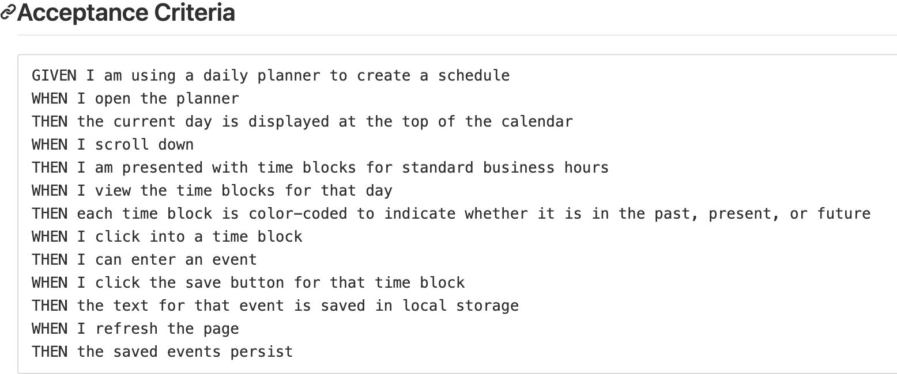

# diaDeSemana
# Shane O'Connell
## 12-17-2020

## User Story

## Acceptance Criteria

## Pseudocode 
12/16

  - Looking at the demo page, the workday planner begins, of course, with the current date. 

    - Need to keep track of and display the correct day when the page loads.

    - Information must be saved, even through reloads.  
            - localStorage synced into all time slots (could this be easier by
             having all time slots contained to same "container"?)

    - Colors of hour blocks must coordinate with correct time of day. Ex:  Red for current hour, green for future, and gray for hours past. 

    - Each Hour box will be an input box and needs to be saved with a click on the save button for __that__ hour.

#### Variables

#### eventListeners